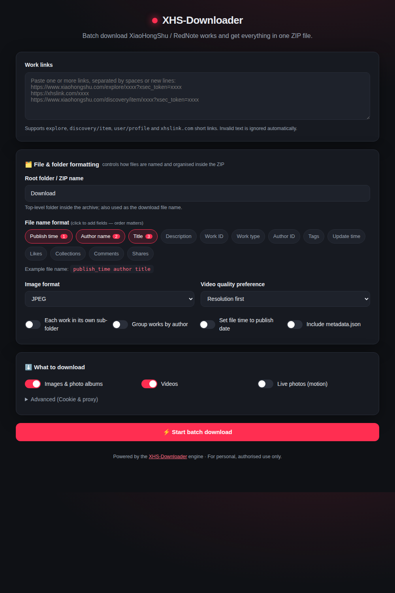

# XHS-Downloader · Batch Web UI

A self-contained web interface for **batch downloading** XiaoHongShu / RedNote
works with rich file & folder formatting options. Everything is packed into a
single **ZIP file** that the user downloads from the browser.

It is inspired by tools like [dlbunny](https://dlbunny.com/en/xhs) and is built
directly on top of the existing `source.XHS` engine — no engine code is
modified. **All feature code lives inside this `webui/` folder.**



## Features

- **Batch input** — paste many links at once (spaces or new lines). Supports
  `explore`, `discovery/item`, `user/profile` and `xhslink.com` short links.
  Invalid text is ignored automatically.
- **One ZIP download** — every downloaded work is packed into a single ZIP,
  named after your root folder.
- **File name builder** — click fields (publish time, author, title, likes,
  tags, …) in the order you want them; an example file name updates live. Click
  a field again to remove it; clear them all to start a new order from scratch.
- **Date format** — render the publish/update time fields as
  `2024-01-31_18:30:45`, `2024-01-31`, `20240131`, `2024.01.31`, `2024-01`,
  `31-01-2024`, … It applies to file names and `metadata.json`; file mtimes are
  always the exact publish timestamp.
- **Folder organisation** — optionally put each work in its own sub-folder
  and/or group works by author.
- **Format control** — choose image format (JPEG / PNG / WEBP / AUTO / HEIC /
  AVIF) and video quality preference (resolution / bitrate / size).
- **Media toggles** — enable/disable images, videos and live photos
  independently.
- **Extras** — write the publish date to file mtimes, and optionally include a
  `metadata.json` describing every work.
- **Advanced** — optional Cookie (for restricted / higher-resolution content)
  and proxy.
- **Live progress** — per-work progress bar, success/fail counts and a live log.

## Running

From the repository root:

```bash
uv run python -m webui
```

`uv run` installs/syncs the project dependencies into the virtual environment on
first use, so no separate install step is needed. If you manage the environment
yourself (`pip install -r requirements.txt`), plain `python -m webui` works too.

Then open <http://127.0.0.1:5557>.

> **That's the only command you need.** The Web UI runs the `XHS` engine
> **in-process**, so you do **not** have to start `uv run python main.py api`
> (the `:5556` REST server) or any other mode first. The `/api/*` routes you see
> below are this server's own endpoints on `:5557`, not the project's API mode —
> the two are independent and never talk to each other.

Configuration via environment variables:

| Variable          | Default     | Description        |
| ----------------- | ----------- | ------------------ |
| `XHS_WEBUI_HOST`  | `127.0.0.1` | Bind host          |
| `XHS_WEBUI_PORT`  | `5557`      | Bind port          |

> The default host `127.0.0.1` keeps the server local-only. Set
> `XHS_WEBUI_HOST=0.0.0.0` if you intentionally want to expose it on your
> network.

## How it works

1. The browser posts the links + options to `POST /api/jobs`, which starts a
   background job and returns a `job_id`.
2. The job configures a `source.XHS` engine instance with a **unique temporary
   working directory**, disables the shared "download history" DB
   (`download_record=False`) so nothing is ever skipped, and downloads every
   link, capturing progress logs.
3. When finished, the working folder is zipped (engine bookkeeping DBs
   excluded) and served from `GET /api/jobs/{id}/download`.
4. The temporary working folder is deleted immediately after zipping; finished
   ZIPs are cleaned up automatically after 1 hour.

Because the engine is a process-wide singleton with shared HTTP clients, jobs
are serialised with an `asyncio` lock — multiple users can queue jobs, and they
run one after another.

## Integration with XHS-Downloader

XHS-Downloader is really **one engine with several front-ends**. The engine is
`source.application.app.XHS`; `main.py` dispatches to the different front-ends:

| Command                         | Front-end       | Serves                     |
| ------------------------------- | --------------- | -------------------------- |
| `uv run python main.py`         | TUI (Textual)   | terminal app               |
| `uv run python main.py api`     | FastAPI REST    | `:5556/xhs/detail`         |
| `uv run python main.py mcp`     | MCP server      | `:5556/mcp/`               |
| `uv run python main.py <args>`  | CLI (click)     | terminal                   |
| **`uv run python -m webui`**    | **Web UI**      | **`:5557` (this folder)**  |

The Web UI is **just another consumer of the same engine** — it imports `XHS`
and calls the identical pipeline the other modes use:

```
webui/app.py
   └─ from source import XHS
        XHS(**engine_kwargs)          # same constructor the TUI/API/MCP/CLI call
        └─ xhs.extract_links(text)    # same link parsing (explore/item/user/xhslink)
        └─ xhs.extract(link, ...)     # same Download / Image / Video / Html modules
```

### What it shares with the other modes

- **The engine and every option.** `folder_name`, `name_format`, `image_format`,
  `video_preference`, `folder_mode`, `author_archive`, `image/video/live_download`,
  `write_mtime`, `cookie`, `proxy` are the exact `XHS(...)` parameters documented
  in the project README's *配置文件 / Settings* table.
- **The `name_format` field tokens.** The UI's friendly ids (`title`, `author`,
  `likes`, …) map to the same Chinese tokens the engine expects, via
  `NAME_FIELDS` in `app.py`. A format built in the UI behaves identically to one
  set in `settings.json`.
- **Link parsing and download logic.** No copies or re-implementations — the UI
  reuses `extract_links()` and `extract()` verbatim, so any engine fix or new
  supported link type is picked up automatically.

### What it deliberately does *not* share (isolation)

This is what keeps the Web UI from interfering with your TUI/CLI usage:

| Concern                | Other modes                          | Web UI                                                    |
| ---------------------- | ------------------------------------ | --------------------------------------------------------- |
| Settings source        | `Volume/settings.json`               | per-job options from the browser (never reads/writes it)  |
| Download location      | `Volume/Download`                    | a unique temp dir per job, deleted after zipping          |
| History DB (skip)      | `Volume/ExploreID.db` (`download_record`) | disabled — every job downloads fresh, skips nothing   |
| Metadata DB            | `Volume/.../ExploreData.db` (`record_data`) | disabled — optional `metadata.json` in the ZIP instead |
| Date format            | `Explore.time_format` (`%Y-%m-%d_%H:%M:%S`) | chosen per job, set on the engine instance at run time |
| Concurrency            | one session per process              | jobs serialised with an `asyncio` lock (engine is a singleton) |

Because it reads none of your persisted config and writes to throwaway temp
dirs, running the Web UI **cannot overwrite your `settings.json`, pollute your
`Volume/Download` folder, or mark works as "already downloaded"** for the other
modes.

### Optionally wiring it into `main.py`

To keep every feature in a single folder, the Web UI ships as a standalone
`python -m webui` entry point and does **not** modify `main.py`. If you later
want a `uv run python main.py web` subcommand, it is a small, self-contained addition
(the dispatcher in `main.py` already branches on `argv[1]`):

```python
# in main.py, in the __main__ block alongside the api / mcp branches.
# webui.__main__.main() is synchronous (it calls uvicorn.run itself),
# so it does not need asyncio.run():
elif argv[1].upper() == "WEB":
    from webui.__main__ import main as run_web
    run_web()
```

See [`ARCHITECTURE.md`](ARCHITECTURE.md) for the request/data flow in detail.

## API

| Method | Path                        | Purpose                          |
| ------ | --------------------------- | -------------------------------- |
| `GET`  | `/`                         | The web UI                       |
| `GET`  | `/api/fields`               | Available formatting field ids   |
| `POST` | `/api/jobs`                 | Start a batch job → `{job_id}`   |
| `GET`  | `/api/jobs/{id}`            | Job status / progress / logs     |
| `GET`  | `/api/jobs/{id}/download`   | Download the resulting ZIP       |

## Notes & limitations

- A Cookie is not required, but improves reliability and unlocks
  high-resolution video. Without one, some works may return low-resolution
  files or fail with `403`.
- XHS links carry a dated `xsec_token`; use freshly-copied links for best
  results.
- For personal, authorised use only. Respect XiaoHongShu's terms and the
  original creators' rights.
